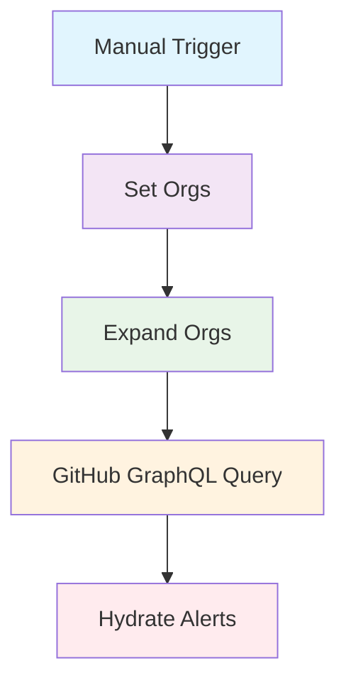

# GitHub GraphQL Vulnerability Collector

This n8n workflow collects vulnerability alerts from GitHub repositories across specified organizations using the GitHub GraphQL API.

## Overview

The workflow queries GitHub's GraphQL API to retrieve security vulnerability alerts for all repositories in the configured organizations. It filters out archived repositories and provides a structured output of vulnerability information.

## Features

- Fetches vulnerability alerts from multiple GitHub organizations
- Uses GraphQL API for efficient data retrieval
- Excludes archived repositories from the scan
- Provides detailed vulnerability information including severity, affected packages, and fix versions
- Outputs data in a structured JSON format suitable for further processing

## Prerequisites

- n8n instance (self-hosted or cloud)
- GitHub API token with the following permissions:
  - `read:org` (to access organization repositories)
  - `security_events` (to read vulnerability alerts)

## Setup Instructions

1. **Import the Workflow**
   - Download the `github-vulnerability-collector-graphql.json` file
   - Import it into your n8n instance via the UI or API

2. **Configure GitHub Credentials**
   - In n8n, create a new credential of type "GitHub API"
   - Enter your GitHub personal access token
   - Name the credential "GitHub Vulnerability Collector" (or update the workflow to match your credential name)

3. **Customize Organizations** (Optional)
   - Edit the "Set Orgs" node to modify the list of organizations to scan
   - Default organizations: `["example-org-1", "example-org-2"]`

4. **Activate the Workflow**
   - Set the workflow to active in n8n
   - Configure any desired schedules or triggers

## How It Works

1. **Manual Trigger**: Starts the workflow execution
2. **Set Orgs**: Defines the list of GitHub organizations to scan
3. **Expand Orgs**: Creates separate workflow items for each organization
4. **GitHub GraphQL Query**: Queries the GitHub API for repositories and vulnerability alerts
5. **Hydrate Alerts**: Processes the API response and formats the vulnerability data

## Workflow Visualization



## Output Format

The workflow outputs an array of JSON objects with the following structure:

```json
{
  "org": "organization-name",
  "repo": "repository-name",
  "tool": "dependabot",
  "severity": "CRITICAL|HIGH|MODERATE|LOW",
  "summary": "Brief description of the vulnerability",
  "package": "affected-package-name",
  "ecosystem": "NPM|RUBYGEMS|MAVEN|PIP|NUGET|COMPOSER|CARGO",
  "fixed_version": "version-that-fixes-the-vulnerability",
  "created_at": "2023-01-01T00:00:00Z"
}
```

If no vulnerabilities are found, the output will be:

```json
{
  "message": "No vulnerabilities found"
}
```

## API Rate Limits

GitHub GraphQL API has rate limits. For authenticated requests:
- 5,000 points per hour
- Each repository query consumes points based on complexity

Monitor your API usage and consider implementing pagination for large organizations.

## Troubleshooting

- **Authentication Errors**: Ensure your GitHub token has the required permissions
- **Rate Limiting**: If hitting rate limits, consider reducing the frequency of runs or implementing pagination
- **Empty Results**: Check that the organizations exist and contain repositories with vulnerability alerts

## Security Notes

- Store your GitHub API token securely in n8n credentials
- Regularly rotate your API tokens
- Limit the scope of tokens to only necessary permissions
- Monitor workflow executions for unauthorized access

## Contributing

To modify this workflow:
1. Export the workflow from n8n
2. Make changes to the JSON structure
3. Test thoroughly before deploying
4. Update this README if adding new features

## License

This workflow is provided as-is. Please ensure compliance with GitHub's API terms of service and your organization's security policies.